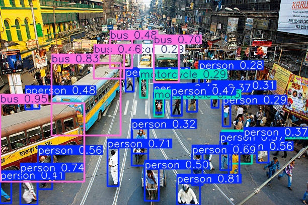

# Edge AI Object Detection Performance Benchmark Framework

A lightweight benchmarking framework for evaluating the runtime performance of Ultralytics YOLO object detection models across heterogeneous computing platforms.

The framework performs automated system profiling, repeated inference benchmarking, statistical analysis, and structured report generation to facilitate performance evaluation and deployment validation of object detection workloads.

---

## Features

- Automated hardware and software profiling
- YOLO model inspection
- Input image analysis
- Model loading benchmark
- Warm-up execution
- Configurable multi-run inference benchmark
- End-to-end latency measurement
- Preprocessing, inference and postprocessing analysis
- CPU utilization monitoring
- Memory utilization monitoring
- CPU frequency monitoring
- Detection count analysis
- Detection confidence analysis
- Object class distribution
- Statistical performance evaluation
- Automatic report generation
- TXT, CSV and JSON export

---

## Benchmark Workflow

```
Load Model
      │
Warm-up
      │
Repeated Inference
      │
Collect Runtime Metrics
      │
Statistical Analysis
      │
Generate Benchmark Reports
```

---

## Metrics Collected

### System Information

- Operating System
- Host Information
- CPU Architecture
- Physical and Logical CPU Cores
- CPU Frequency
- RAM Usage
- Disk Information
- Python Version
- OpenCV Version
- PyTorch Version
- Ultralytics Version
- CUDA Availability
- GPU Information

### Model Information

- Model Name
- Model Size
- Total Parameters
- Trainable Parameters
- Number of Layers
- Input Shape
- Precision
- Number of Classes

### Performance Metrics

- Model Load Time
- Warm-up Performance
- End-to-End Latency
- Preprocessing Time
- Inference Time
- Postprocessing Time
- CPU Usage
- RAM Usage
- CPU Frequency
- Detection Count
- Detection Confidence
- Object Class Distribution

### Statistical Analysis

The following statistics are computed for every benchmark metric.

- Mean
- Median
- Minimum
- Maximum
- Range
- Standard Deviation
- Variance
- Percentiles (P10, P25, P50, P75, P90, P95, P99)
- Coefficient of Variation
- Throughput
- Average FPS

---

## Project Structure

```
Object-Detection-Using-NVIDIA-JETSON/

│
├── benchmark.py
├── config.py
├── requirements.txt
├── image.jpg
├── sample_output_laptop1.jpg
├── sample_output_laptop2.jpg
├── sample_output_gpu.jpg
├── README.md
├── LICENSE
├── .gitignore
│
├── core/
│   ├── __init__.py
│   ├── gpu_info.py
│   ├── image_info.py
│   ├── jetson_info.py
│   ├── model_info.py
│   ├── statistics_utils.py
│   └── system_info.py
│
├── utils/
│   ├── __init__.py
│   ├── exporter.py
│   └── graphs.py
│
└── results/
    ├── benchmark_report_laptop1.csv
    ├── benchmark_report_laptop1.json
    ├── benchmark_report_laptop1.txt
    ├── benchmark_report_laptop2.csv
    ├── benchmark_report_laptop2.json
    ├── benchmark_report_laptop2.txt
    ├── benchmark_report_gpu.csv
    ├── benchmark_report_gpu.json
    └── benchmark_report_gpu.txt
```

---

## Installation

Clone the repository.

```bash
git clone https://github.com/Harshit8717/Object-Detection-Using-NVIDIA-JETSON-.git
```

Move into the project directory.

```bash
cd Object-Detection-Using-NVIDIA-JETSON-
```

Install the required dependencies.

```bash
pip install -r requirements.txt
```

---

## Running the Benchmark

Execute

```bash
python benchmark.py
```

The framework automatically performs

- Model loading
- Warm-up execution
- Repeated inference benchmarking
- Runtime monitoring
- Statistical analysis
- Report generation

---

## Benchmark Reports

Each execution automatically generates

```
results/

benchmark_report.txt
benchmark_report.csv
benchmark_report.json
```

along with an annotated detection image for visual verification.

---

## Experimental Configurations

Current benchmark reports included in this repository.

| Platform | Execution Device | Status |
|----------|------------------|--------|
| Laptop 1 | CPU | Completed |
| Laptop 2 | CPU | Completed |
| Laptop 2 | NVIDIA GPU | Completed |

---

## Results Preview

### Laptop 1 (CPU)


---

### Laptop 2 (CPU)


---

### Laptop 2 (NVIDIA GPU)



---

## Dependencies

- Python 3.10+
- Ultralytics
- PyTorch
- OpenCV
- NumPy
- psutil
- py-cpuinfo
- matplotlib

Install all required packages using

```bash
pip install -r requirements.txt
```

---

## Applications

- Edge AI benchmarking
- Object detection performance evaluation
- Embedded vision systems
- Hardware comparison
- Runtime profiling
- Deployment validation
- Performance characterization

---

## License

This project is distributed under the MIT License. See the LICENSE file for additional information.
